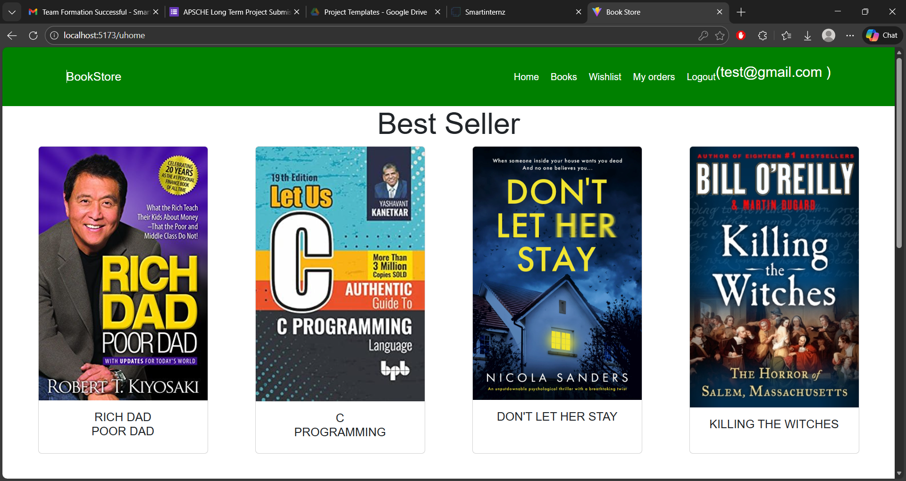
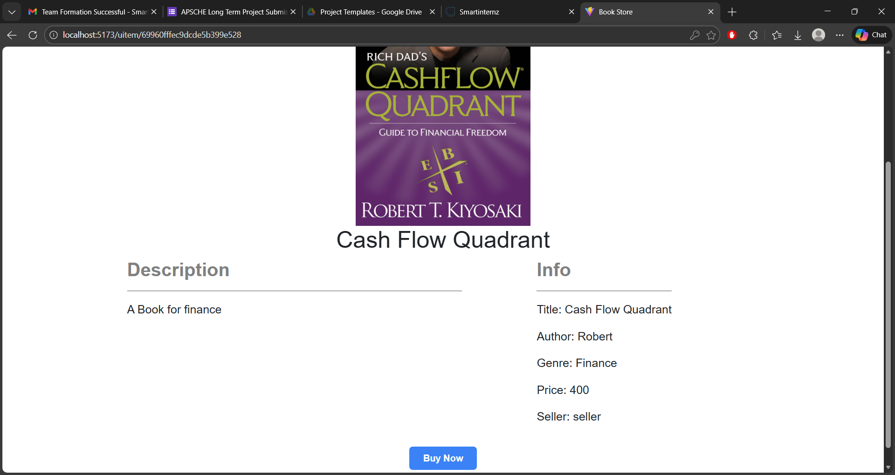
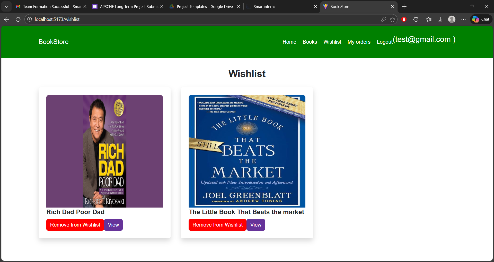
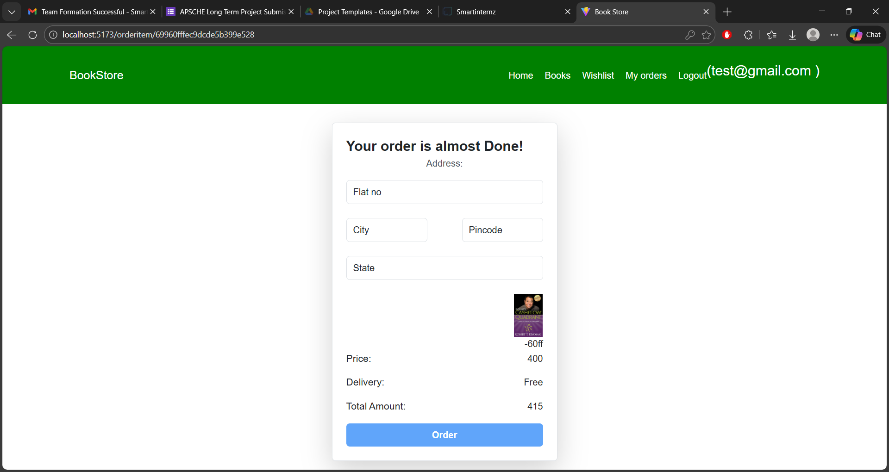
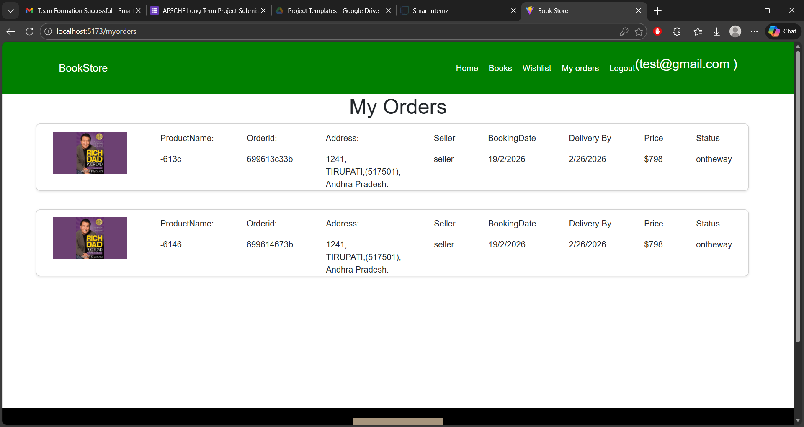
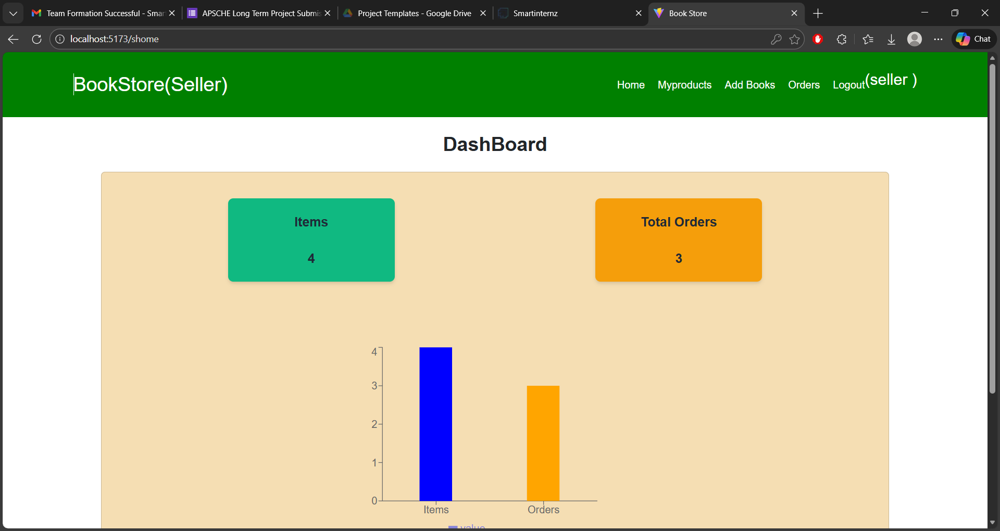
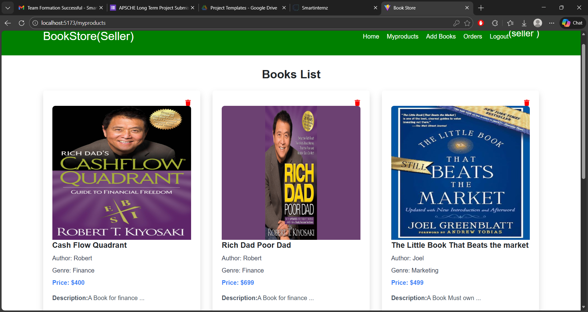
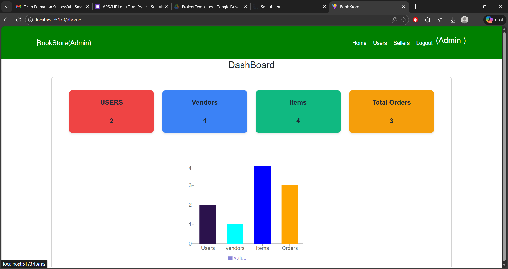

# BookNest Demonstration Checklist

## Demo Assets
- Presentation slides (PPT/PDF)
- Application screenshots (user, seller, admin views)
- Short demo video (optional)
- Live demo URL (if hosted)
- Repository link

## Suggested Demo Flow
1. Project overview and goals
2. User flow: signup/login -> browse -> wishlist -> buy now -> order tracking
3. Seller flow: signup/login -> add book -> manage listings -> view orders
4. Admin flow: view/manage users, sellers, and books
5. Tech stack and architecture summary
6. Testing summary and known issues
7. Future enhancements

## Evidence Checklist
- Screenshot: Home / Catalog

- Screenshot: Book details

- Screenshot: Wishlist

- Screenshot: Buy now / Order form

- Screenshot: My orders / Order status

- Screenshot: Seller dashboard / My products

- Screenshot: Admin dashboard

